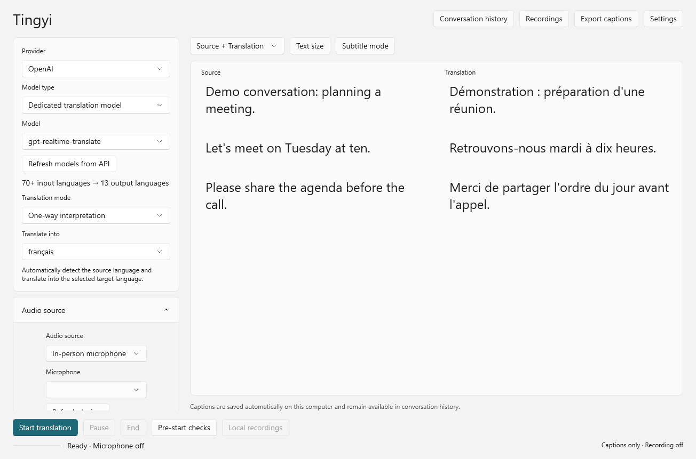
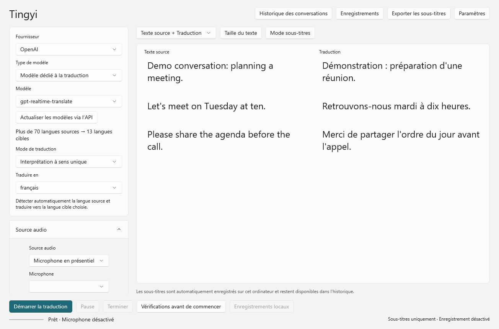

# Tingyi / 听译

Tingyi is a translation app built for face-to-face conversations. Follow what someone is saying with bilingual captions, or listen to the translation through your headphones.

The Tower of Babel is the idea behind Tingyi: helping people who speak different languages talk to each other.

- **Bilingual captions** — See the original speech and its translation together.
- **Headphone audio** — Listen to translations without having to keep reading the screen.
- **Floating captions** — Keep the conversation in view while using other windows.
- **Flexible audio input** — Translate microphone input, computer audio, or both.

**[Download for Windows](https://github.com/yachael/Tingyi/releases/download/v0.2.11-preview/Tingyi-Windows-x64-0.2.11-preview.exe)** · Windows 11 x64 · v0.2.11 preview

[Getting started](docs/GETTING-STARTED.md) · [What's new](docs/RELEASE-NOTES-0.2.11.md)

## A look inside

English interface:

French interface:

*Interface examples from the 0.2.3 demo build.*

## Français

Tingyi est une application de traduction conçue pour les conversations en face à face. Suivez les échanges avec des sous-titres bilingues ou écoutez la traduction au casque.

Inspiré de la tour de Babel, le projet aide les personnes qui parlent des langues différentes à discuter ensemble.

- **Sous-titres bilingues** : retrouvez les paroles originales et leur traduction.
- **Traduction au casque** : écoutez sans devoir garder les yeux sur l'écran.
- **Fenêtre flottante** : gardez les sous-titres sous les yeux pendant que vous utilisez d'autres fenêtres.
- **Choix de la source audio** : microphone, son de l'ordinateur ou les deux.

**[Télécharger pour Windows](https://github.com/yachael/Tingyi/releases/download/v0.2.11-preview/Tingyi-Windows-x64-0.2.11-preview.exe)** · [Premiers pas](docs/GETTING-STARTED.md#français)

## 中文

听译是一款为面对面交流设计的翻译软件。聊天时，可以同时看原文和译文，也可以戴上耳机听翻译。

巴别塔是这个项目的灵感来源。我们想做的很简单：让说不同语言的人，也能聊得起来。

- **双语字幕**：原文和译文一起看，更容易跟上对话。
- **耳机译音**：用耳机听翻译，聊天时不用一直盯着屏幕。
- **悬浮字幕**：打开其他窗口，也能看见对话内容。
- **灵活收音**：支持麦克风、电脑声音和混合输入，按场景选择。

**[下载 Windows 版](https://github.com/yachael/Tingyi/releases/download/v0.2.11-preview/Tingyi-Windows-x64-0.2.11-preview.exe)** · [使用说明](docs/GETTING-STARTED.md#中文)

目前先做好 Windows 版，之后再开发 iPhone 版。
